# Generation Analysis — Inverse Design

Running the surrogate backward: given a droop budget and topology,
gradient-optimize the two knobs to the cheapest grid that meets spec, then
validate against the real simulator. Surrogate = coordinate-free 7-hop model.
Mechanics in [INVERSE_DESIGN_MECHANICS.md](INVERSE_DESIGN_MECHANICS.md).
Reproduce: `python3.12 scripts/design_grad.py --target-mV {0.10,0.15,0.20}`,
then `scripts/plot_generation.py`.

**Summary:** the loop recovers physically sensible designs — monotone cost vs
budget, more metal for sparser topologies, lands on the spec boundary, flags
genuine infeasibility. In-distribution (n_top 3, 7) it lands the requested droop
to a few µV. On the unseen n_top 4 the surrogate is conservative (over-predicts
droop) — safe, except that its wire-width response there is non-monotonic, which
caused one false rejection of an achievable spec (§4).

## 1. Method

```
(wire_width, C_decap)  ← two free knobs, optimized directly
   │ differentiable graph build → frozen surrogate → predicted worst droop
   │ loss = ReLU(droop/budget − 1)²  +  λ·cost(width, decap)
   │ backprop to the knobs, Adam step
   ▼ recovered design → validate against the simulator
```

Each knob is sigmoid-reparameterized into its range (`wire_width ∈ [0.2,1.0]`,
`C_decap ∈ [5e-11,8e-10]` log-space), so no projection step is needed. The hinge
is zero once feasible, so the cost term then pulls the solution to the cheapest
point on the spec boundary.

## 2. Results

`sim` = simulator at the recovered design.

| budget | n_top | wire_width | C_decap | pred (mV) | sim (mV) | verdict |
|---|---|---|---|---|---|---|
| 0.10 | 3 | 0.986 | 7.2e-10 | 0.113 | 0.113 | ✗ truly infeasible |
| | 4 (OOD) | 0.736 | 7.7e-10 | 0.141 | 0.122 | ✗ false reject (§4) |
| | 7 | 0.831 | 2.3e-10 | 0.099 | 0.099 | ✓ |
| 0.15 | 3 | 0.909 | 4.2e-10 | 0.134 | 0.134 | ✓ |
| | 4 (OOD) | 0.713 | 5.6e-10 | 0.150 | 0.132 | ✓ |
| | 7 | 0.601 | 5.1e-11 | 0.150 | 0.150 | ✗ boundary |
| 0.20 | 3 | 0.613 | 2.5e-10 | 0.200 | 0.200 | ✓ |
| | 4 (OOD) | 0.631 | 2.4e-10 | 0.196 | 0.183 | ✓ |
| | 7 | 0.448 | 5.1e-11 | 0.197 | 0.197 | ✓ |

No design the tool *certifies* is overturned by the simulator. The one error runs
the other way: at 0.10 / n_top 4 it rejects an achievable spec (§4).

## 3. The design is physically correct

**Fidelity where the optimizer lands.** The optimizer drives to the aggressive
corner, where the surrogate is least precise on average — so what matters is
fidelity *there*, not aggregate R².

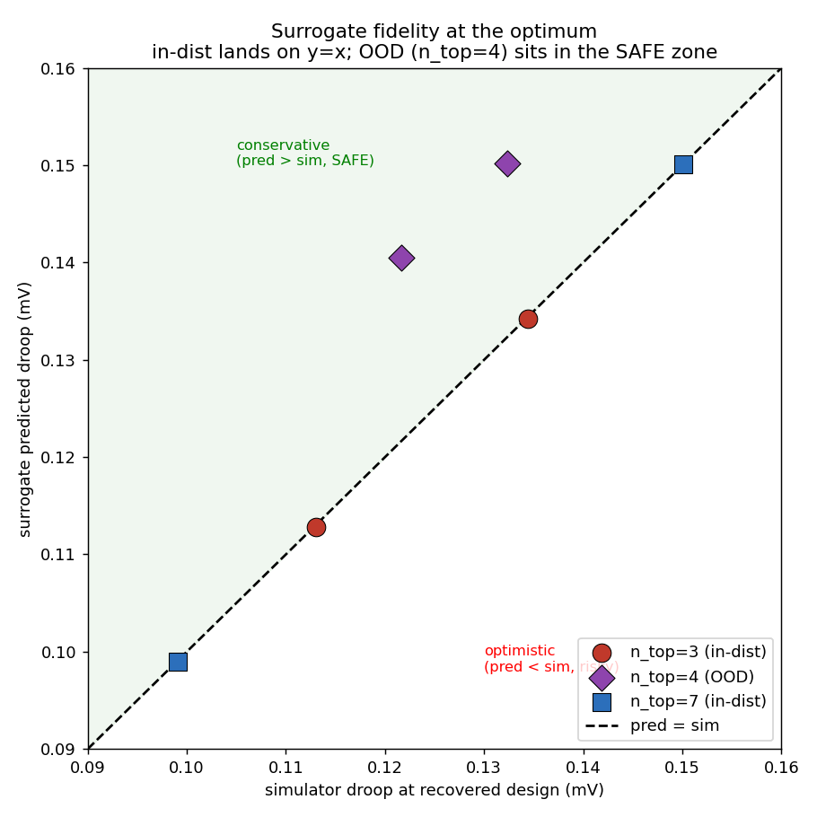

In-distribution (n_top 3, 7) pred ≈ sim on y = x. OOD (n_top 4) the points sit
above y = x — conservative: anything certified feasible is feasible with margin.

**Cost tracks budget; metal tracks topology.**

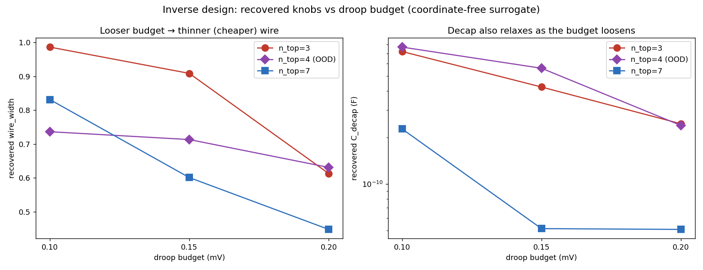
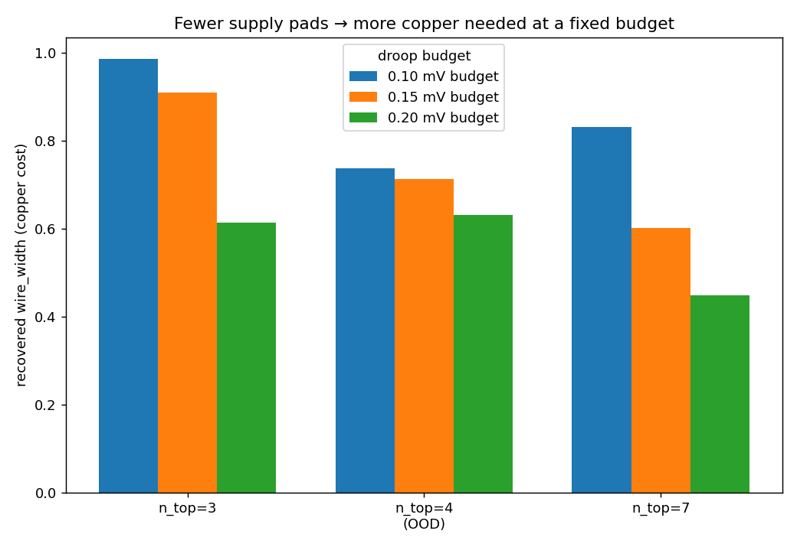

Looser budget → less wire and cap (every topology, monotone). At fixed budget,
supply-rich n_top 7 needs the least metal and sparse n_top 3 the most — learned
PDN physics. It lands at the budget (e.g. sim 0.200/0.200) rather than
over-building, and flags genuine infeasibility (0.10 / n_top 3: wire pinned at
0.986, sim still 0.113 > 0.10).

### 3.1 Watching it choose

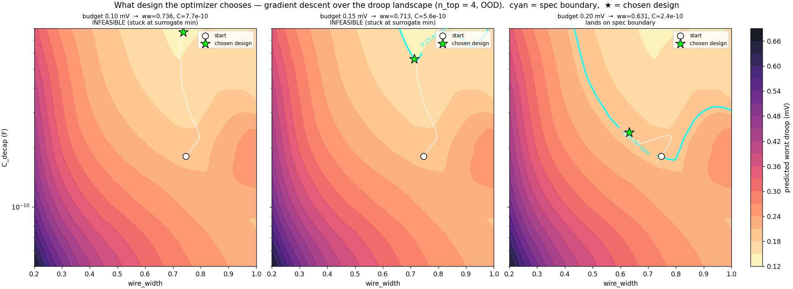

Descent over the predicted-droop contours (n_top 4), spec boundary in cyan, path
from start (○) to chosen design (★). At 0.20 mV it lands on the boundary (and the
boundary's non-monotonic "elbow" on the fat-wire side is visible — the §4
pathology). At 0.15/0.10 the path stalls at the surrogate's interior minimum
without touching the boundary (infeasible).

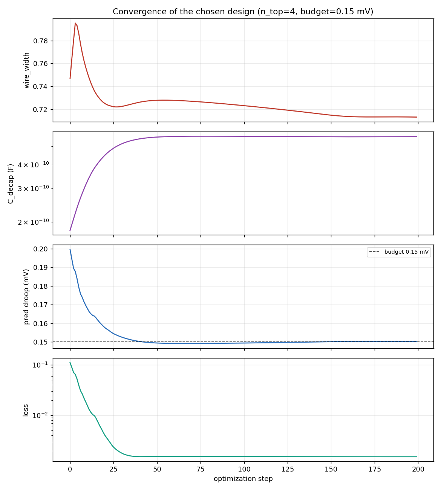

Predicted droop drops to the budget line and sits there while the knobs keep
trading cost — "meet spec, then minimize metal."

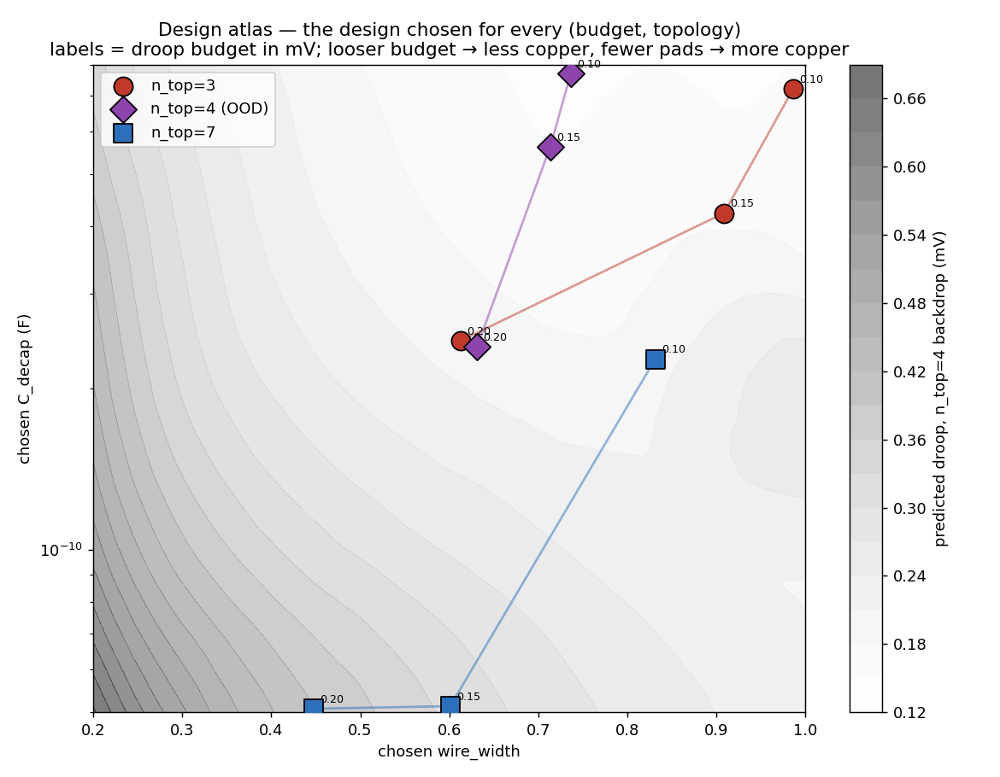

Every chosen design (3 budgets × 3 topologies): looser budget → lower-left (less
metal); n_top 7 track far below n_top 3.

### 3.2 In-distribution recovery is near-exact

Sweeping many droop targets on the training topologies isolates the optimizer
from surrogate error:

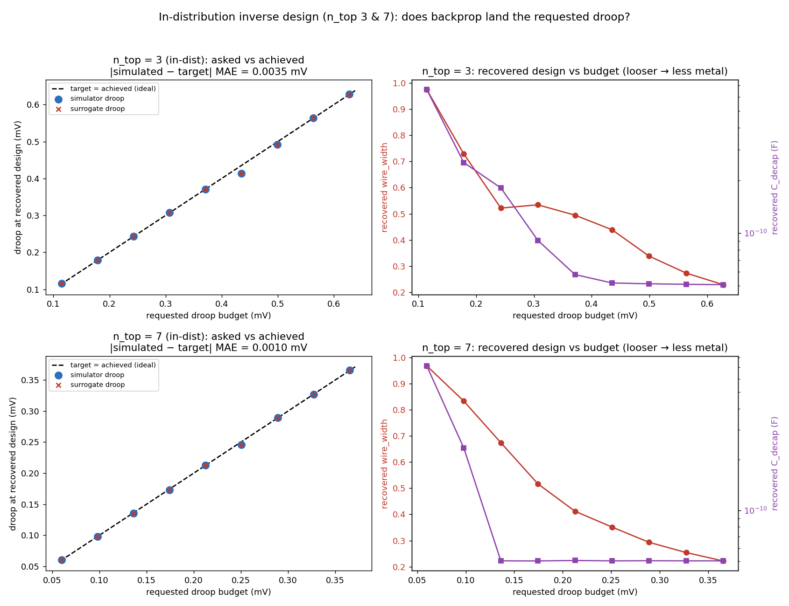

Target ≈ surrogate ≈ simulator, all on y = x:

| topology | \|sim − target\| MAE | \|pred − sim\| MAE |
|---|---|---|
| n_top 3 | 0.0035 mV | 0.0004 mV |
| n_top 7 | 0.0010 mV | 0.0001 mV |

The loop lands the true droop to a few µV. (A few points sit a hair under budget
where `C_decap` is pinned at its floor and only `wire_width` is left — a flat
cost-gradient at a knob limit, not a failure.) Reproduce:
`scripts/check_backprop_indist.py`.

## 4. The one failure — non-monotonic OOD response → false rejection

Sweeping surrogate vs simulator along wire width (decap near ceiling):

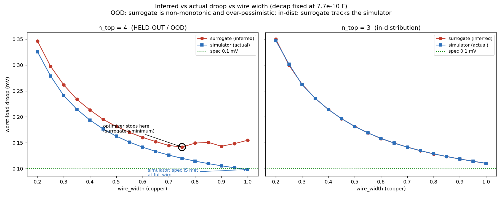
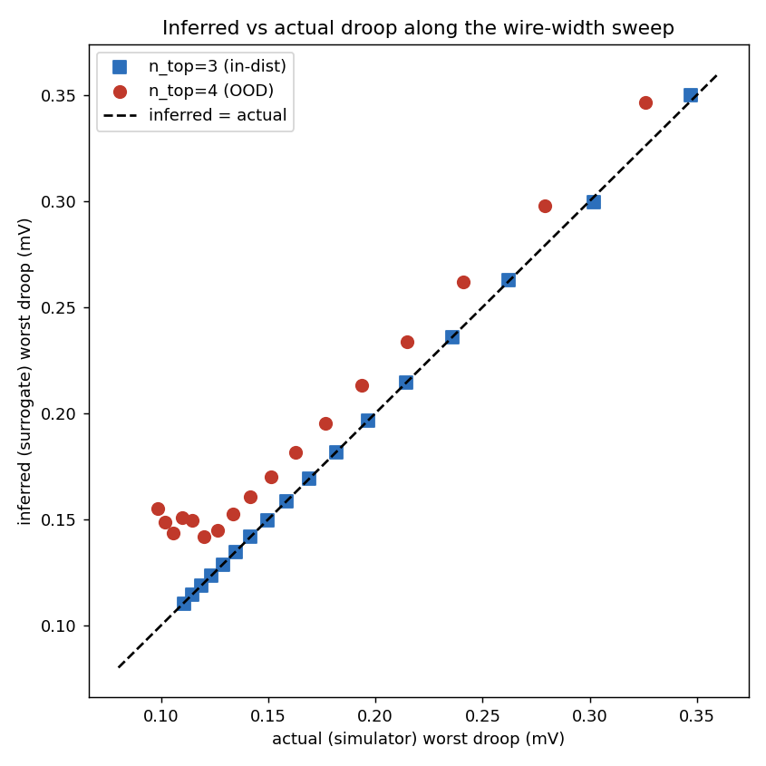

- **n_top 4 (OOD):** the simulator is monotonic — full wire reaches 0.098 mV,
  which *meets* the 0.10 spec. The surrogate tracks it down to wire ≈ 0.74 then
  turns back up (predicts droop *rises* with more copper — unphysical). The
  optimizer descends to that spurious minimum and stops, so it reports infeasible.
- **n_top 3 (in-dist):** surrogate and simulator coincide.

Across both knobs, the failure is localized and axis-specific:

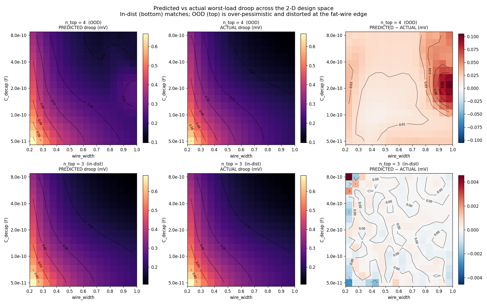
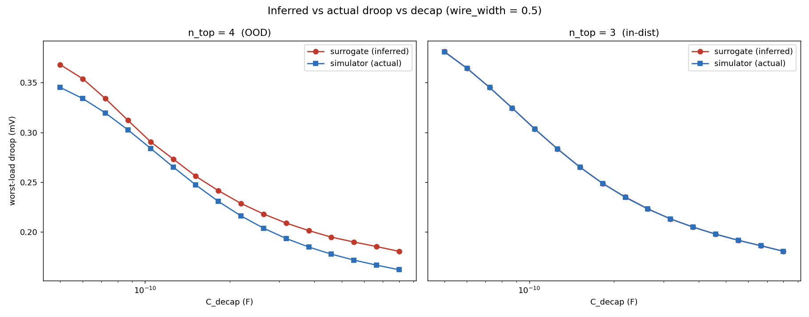

The 2-D maps match in-distribution (±0.004 mV) but show a one-signed
over-prediction blob (~0.10 mV) at the fat-wire edge OOD. Along **capacitance**
the OOD surrogate is monotonic and only mildly conservative — the pathology is
specific to the **wire-width / conductance** axis.

**Reading:**

1. This is a **false rejection**, not a correct infeasibility verdict — the spec
   is achievable (sim 0.098 ≤ 0.10). Conservatism prevents the dangerous error
   (certifying a bad grid) but can reject a good one.
2. The fault is the surrogate's response surface, not the optimizer — the model
   never saw n_top 4, so it doesn't respect "more copper → less droop" there.
3. Root cause is topology coverage, as everywhere else OOD.

**Fixes:** more training topologies (the real fix); enforced monotonicity in
wire/conductance; simulator-in-the-loop refinement. Multi-start would *not* help
— the surrogate's own optimum is the bad point.

## 5. Recommended use

Surrogate proposes, simulator confirms: the surrogate collapses a slow search to
a few candidates; the simulator certifies the final pick.
