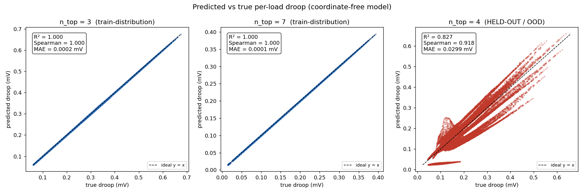
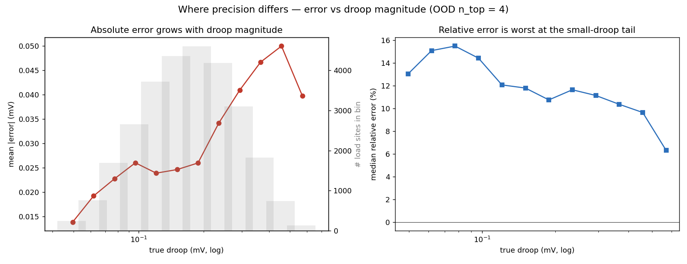
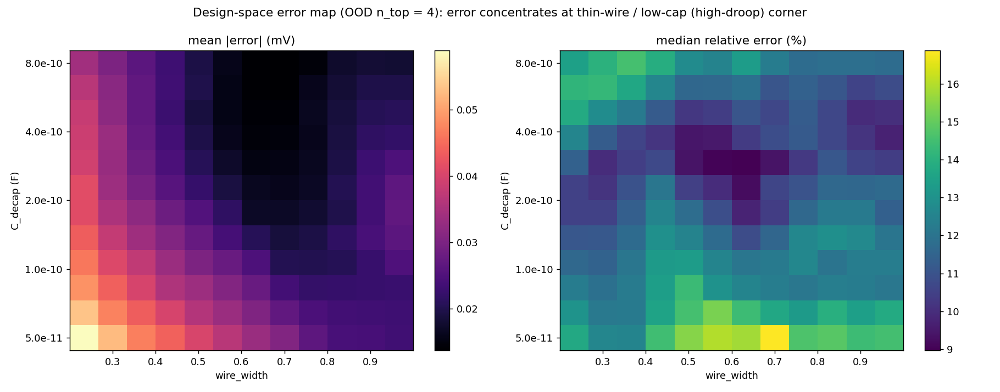
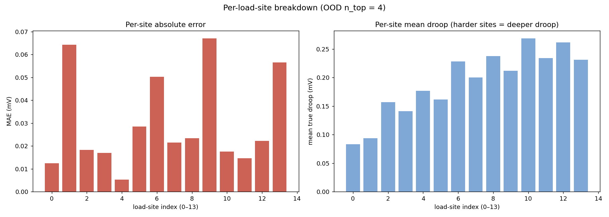
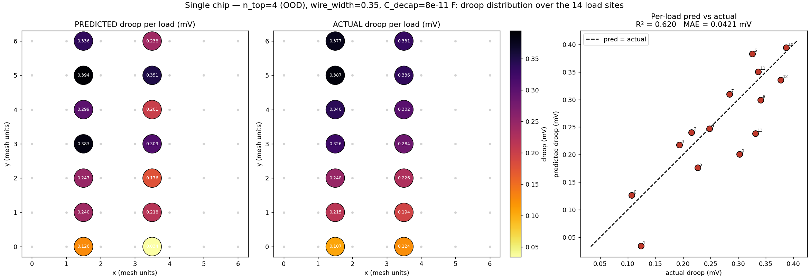
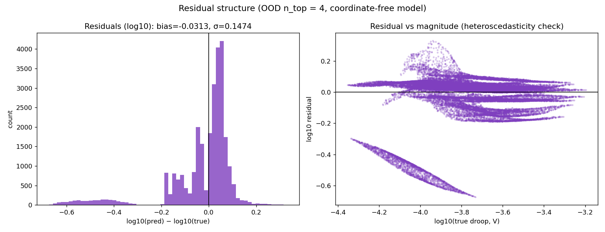

# Prediction Analysis — Forward Accuracy

Where the droop surrogate is accurate and where it degrades. Numbers are for the
coordinate-free 7-hop model; figures in [`figures/`](figures/). Reproduce:
`python3.12 scripts/analyze_predictions.py` (metrics →
[`analysis/prediction_metrics.json`](analysis/prediction_metrics.json)).

**Summary:** in-distribution the model is essentially exact (R² > 0.99999). On
the held-out n_top 4 (OOD), per-site R² = 0.827 but Spearman = 0.918, and on the
design-binding worst-load number R² = 0.944, Spearman = 0.987 — correlation and
ranking degrade far more gracefully than absolute precision. Error is structured,
not random: largest (absolute) at deep droop, worst (relative) at the shallow
tail, concentrated at the thin-wire/low-cap corner and at load sites far from a
pad in the unseen topology — i.e. a topology-coverage limit, not model capacity.

## 1. Two metrics, and why they diverge

| split | topology | per-site R² | Spearman | MAE | rel-MAE |
|---|---|---|---|---|---|
| train | n_top 3 & 7 | 0.99999 | 1.000 | 0.0001 mV | 0.06% |
| val | n_top 3 & 7 | 0.99999 | 1.000 | 0.0001 mV | 0.06% |
| test | n_top 4 (OOD) | 0.827 | 0.918 | 0.030 mV | 15.6% |

Two points:

1. **R² understates usefulness.** R² is an absolute squared-error metric and
   punishes a small systematic offset heavily; Spearman (0.918) measures ranking
   and is much higher — the model rarely confuses a high-droop design for a
   low-droop one OOD.
2. **Per-site vs worst-load.** The design question is the worst droop on the chip,
   not droop at a given site. Collapsing the 14 per-site predictions to the
   per-sample max:

| OOD n_top 4 | per-site | worst-load |
|---|---|---|
| R² | 0.827 | 0.944 |
| Spearman | 0.918 | 0.987 |
| MAE | 0.030 mV | 0.021 mV |
| rel-MAE | 15.6% | 7.8% |

In-distribution (left, middle) points lie on y = x; OOD (right) the cloud fans
out but stays tightly correlated and monotonic.

### 1.1 Why worst-load R² (0.944) > per-site (0.827)

There is no separate worst-load head: the model is a shared encoder + a shared
per-load head (concat the load edge's Vdd/Vss endpoint states, 128→64→1), run
once per load edge → 14 predictions, and **worst-load is just `max` over them**.
So the gap is a property of the target statistics, and `max` improves both terms
of `R² = 1 − var(error)/var(target)`:

| OOD n_top 4 | per-site (28k) | worst-load (2k) |
|---|---|---|
| target variance | 0.0089 | 0.0110 |
| RMSE | 0.039 mV | 0.025 mV |
| R² | 0.827 | 0.944 |

- **Smaller error.** The worst site is always deep-droop, where relative error is
  lowest (~8% vs ~15%, §2). `max(pred)` vs `max(true)` also cancels
  which-site-is-worst misranking.
- **Larger, cleaner variance.** Per-site variance is 43% within-design (the fine
  load-site pattern set by the unseen pad spacing — the hardest part OOD) and 57%
  across-design. `max` drops the within-design part and keeps the across-design
  trend the model captures well.

## 2. Error vs droop magnitude

- Absolute error grows with droop (~0.014 → ~0.05 mV): bigger signals, bigger
  absolute misses, and deep droop is most topology-sensitive.
- Relative error is worst at the shallow tail (~15% → ~6%): tiny droops are
  dominated by long-range IR that depends most on the exact pad layout.

Favorable for design: the model is relatively most accurate near the spec
boundary (large droop), and sloppiest where the designer doesn't care (shallow).

## 3. Error vs design space

Absolute error concentrates in the thin-wire/low-cap (high-droop) corner; the
fat-wire/high-cap region is near-perfect. Relative error peaks along the lowest-
cap edge. So the surrogate is least precise in the aggressive corner the
optimizer is pushed toward — which is why recovered designs are always validated
against the simulator ([GENERATION_ANALYSIS.md](GENERATION_ANALYSIS.md)).

## 4. Error vs load-site geometry

Sites are not equally hard — a few (≈1, 9, 13) carry 3–5× the MAE of the easiest.
This partly tracks droop depth but not entirely (site 1 is shallow yet
high-error): the high-error sites are the bot-mesh positions furthest from a via
in the n_top 4 tap pattern specifically. The error has spatial structure tied to
the unseen pad layout — a coverage problem, not capacity.

### 4.1 One chip, laid out

One aggressive n_top 4 chip, all 14 loads at their mesh positions colored by
droop — predicted vs simulator, same scale, plus the per-load scatter. The
spatial droop gradient is reproduced **with no coordinate inputs** (inferred from
connectivity + message passing). Per-load R² = 0.62 / MAE = 0.042 mV for this one
aggressive chip (noisier than the 0.827 aggregate because one chip spans a narrow
range in the hardest corner), but the worst load — pred 0.394 vs actual 0.387 mV
— is near-exact. Retarget any chip via `scripts/plot_single_chip.py`.

## 5. Residual structure

- Small negative bias in log space (−0.031 ≈ −7%): slight average
  under-prediction, dominated by shallow non-binding sites.
- The residual-vs-magnitude panel shows banding (each band = one load site's
  systematic offset). The under-predicted streak lives at small droop
  (non-binding sites); the worst-load site is slightly **over**-predicted
  (conservative), confirmed by the inverse-design runs. So at the point that sets
  the spec, the error is on the safe side.
