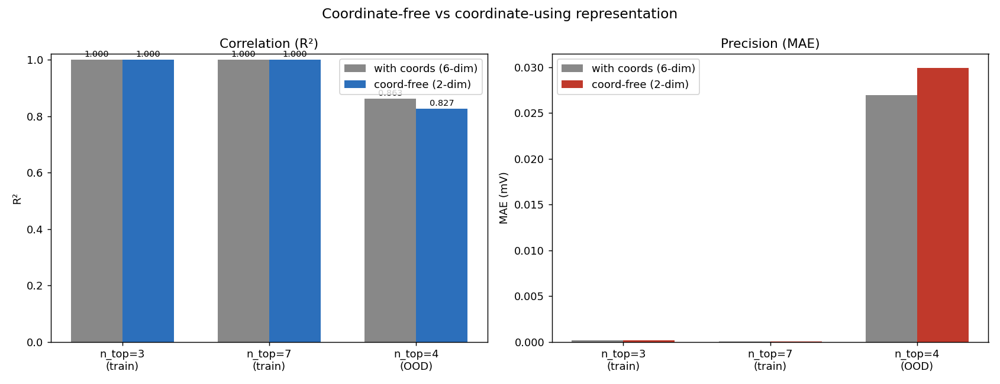

# Prediction Analysis — Where Correlation and Precision Differ

*A detailed look at the droop surrogate's forward predictions: how good they
are, and — more usefully — **where** they are good and where they degrade.
All numbers are for the coordinate-free (2-dim node feature) 7-hop model
unless stated. Figures live in [`figures/`](figures/).*

Reproduce with:

```bash
python3.12 scripts/analyze_predictions.py   # metrics + figures
```

Numbers are dumped to [`analysis/prediction_metrics.json`](analysis/prediction_metrics.json).

---

## 0. TL;DR

- **In-distribution (n_top 3 & 7): essentially exact.** R² > 0.99999, MAE
  < 0.0002 mV. The model has effectively memorized the two training
  topologies' droop physics.
- **Out-of-distribution (held-out n_top = 4): correlation stays high, absolute
  precision loosens.** Per-site R² = **0.827**, but Spearman rank = **0.918**,
  and on the design-binding **worst-load** number R² = **0.944**, Spearman =
  **0.987**.
- **The single most important takeaway:** *correlation degrades far more
  gracefully than precision*. The model keeps **ranking** designs correctly on
  an unseen topology long after its absolute mV predictions start to drift.
  For a design tool, ranking is what matters.
- **Error is magnitude-driven and structured**, not random: it concentrates at
  the deep-droop (thin-wire / low-cap) corner of the design space, and at
  specific load sites that sit far from a supply pad in the unseen topology.

---

## 1. The two metrics, and why they diverge

Every configuration scores ~1.0 on the training topologies, so the validation
number is uninformative (the model interpolates a grid family it has seen
thousands of times). The honest test is the **held-out pad count n_top = 4**.

| split | topology | R² (per-site) | Spearman | MAE (mV) | rel-MAE |
|---|---|---|---|---|---|
| train | n_top 3 & 7 | 0.99999 | 1.000 | 0.0001 | 0.06% |
| val | n_top 3 & 7 | 0.99999 | 1.000 | 0.0001 | 0.06% |
| **test** | **n_top 4 (OOD)** | **0.827** | **0.918** | **0.030** | **15.6%** |

The gap between train and test is the cost of generalizing to a topology never
seen — not noise, not underfitting. Two things deserve emphasis:

1. **R² (0.827) understates the model's usefulness.** R² is an *absolute*
   squared-error metric; it punishes a small systematic mV offset heavily.
   Spearman (0.918) measures whether the model gets the *ordering* right, and
   it is much higher — the model rarely confuses a high-droop design for a
   low-droop one, even on the unseen grid.

2. **Per-site vs worst-load.** The design question is never "what is the droop
   at site 7?" — it is "what is the *worst* droop anywhere on the chip?" When we
   collapse the 14 per-site predictions to the per-sample maximum (the
   spec-binding number), accuracy jumps sharply:

| metric (OOD n_top = 4) | per-site (14/sample) | **worst-load (1/sample)** |
|---|---|---|
| R² | 0.827 | **0.944** |
| Spearman | 0.918 | **0.987** |
| MAE | 0.030 mV | **0.021 mV** |
| rel-MAE | 15.6% | **7.8%** |

The worst-load is the easiest thing to predict and the only thing the designer
cares about. **The model is materially better at its actual job than the raw
per-site R² suggests.**


*In-distribution (left, middle): points collapse onto y = x. OOD (right): the
cloud fans out but stays tightly correlated and monotonic — high-droop designs
are still predicted high.*

### 1.1 Why is worst-load R² (0.944) so much higher than per-site (0.827)?

First, the architecture, because it explains that there is **no separate
worst-load model**. The regressor ([`eason/encoder.py`](../eason/encoder.py)) is:

- a **shared encoder** — node features `[is_vdd, is_pad]` → 7 message-passing
  layers (conductance gate on resistor edges, residual + LayerNorm) → a 64-dim
  hidden state for *every* mesh node, encoding where it sits in the supply
  network;
- a **shared per-load head** — each `load` edge is directed Vdd→Vss; the head
  reads the two endpoint hidden states `[h_vdd ‖ h_vss]` and an MLP
  (128→64→1) emits one `log10(droop)`. Run once per load edge ⇒ **14
  predictions per grid, same weights**.

**Worst-load is simply `max` over those 14 per-site outputs** — not a different
head. So the R² gap is a property of the *target statistics*, and `max` improves
both halves of `R² = 1 − (error variance)/(target variance)`:

| OOD n_top = 4 | per-site (28 000) | worst-load (2 000) |
|---|---|---|
| target mean | 0.192 mV | 0.269 mV |
| **target variance** (denominator) | 0.0089 | **0.0110** |
| **RMSE** (numerator) | 0.039 mV | **0.025 mV** |
| R² = 1 − RMSE²/var | 0.827 | 0.944 |

1. **Smaller error (numerator).** The worst site is always a *deep-droop* site,
   and deep droop is where the model is **relatively** most accurate (~8% vs
   ~15% rel-error — §2). Comparing `max(pred)` to `max(true)` also cancels
   *which-site-is-worst* misranking: getting magnitudes roughly right but
   swapping two near-equal deepest sites barely moves the max-to-max error.
   Per-site error, by contrast, is dragged up by the many shallow sites.
2. **Larger, cleaner variance (denominator).** The per-site target's variance
   splits **43% within-design** (spread across the 14 sites, set by fine
   load-site geometry) and 57% across-design. That within-design part is the
   *hardest* thing to predict OOD — it depends on the exact pad spacing the
   model never saw (§4). The `max` **collapses that hard within-design variation
   away** and keeps only the across-design trend (wire / decap / topology →
   worst droop), which the model captures well.

In short: the `max` discards precisely the variation the model is worst at on an
unseen topology and keeps the variation it is best at — which is also the only
number a designer acts on.

---

## 2. Where precision differs #1 — droop magnitude

Error is **not uniform across the dynamic range**. Splitting the OOD test set
into log-spaced bins of true droop:


- **Absolute error grows with droop** (left). Deep-droop sites (thin wire, low
  cap, far from a pad) carry the largest mV error — mean |error| rises from
  ~0.014 mV at the shallow end to ~0.05 mV at the deep end. This is expected:
  bigger signals leave room for bigger absolute misses, and the deep-droop
  regime is where the physics is most sensitive to topology.
- **Relative error is worst at the shallow tail** (right): ~15% median at the
  smallest droops, falling to ~6% at the largest. Tiny droops are dominated by
  long-range IR contributions that depend most on the exact pad layout — the
  thing that changed between train and test.

For design this is the **favorable** combination: the model is *relatively*
most accurate exactly where droop is large, i.e. near the spec boundary where
decisions are made. The sloppy regime (shallow droop) is the regime the
designer can ignore.

---

## 3. Where precision differs #2 — the design space

Binning the OOD error over the two continuous knobs (`wire_width`, `C_decap`):


- Absolute error (left) is sharply concentrated in the **thin-wire / low-cap
  corner** — the high-droop, hardest-to-cool regime. The fat-wire / high-cap
  region (low droop) is predicted almost perfectly.
- Relative error (right) is flatter but still peaks along the bottom edge
  (lowest cap), where transient droop is most sensitive to the decap that
  isn't there.

**Design implication:** the surrogate is most trustworthy in the
*comfortable* part of the design space and least precise in the *aggressive*
corner. A designer optimizing toward minimum copper is pushed toward exactly
that corner — which is why we **validate every recovered design against the
real simulator** (see [GENERATION_ANALYSIS.md](GENERATION_ANALYSIS.md)).

---

## 4. Where precision differs #3 — load-site geometry

The 14 load sites are not equally hard:


- A handful of sites (≈ 1, 9, 13) carry 3–5× the MAE of the easiest sites.
- Part of this tracks droop depth (right panel — deeper-droop sites tend to be
  harder), but **not entirely**: site 1 is shallow yet high-error. The residual
  pattern is *structural* — these are the bot-mesh positions that sit furthest
  from a supply via in the n_top = 4 tap pattern specifically. The model never
  saw that pad spacing, so the sites whose droop depends most on it are the
  ones it extrapolates worst.

This is the cleanest evidence that the OOD error is a **topology-coverage**
problem, not a model-capacity problem: the error has spatial structure tied to
the unseen pad layout, exactly where you'd predict.

### 4.1 One chip, laid out — predicted vs actual at every load

The aggregate stats above are easier to feel on a single instance. Here is one
chip from the held-out topology (n_top = 4, an aggressive thin-wire / low-cap
design), with all 14 load sources drawn at their physical mesh positions and
colored by droop — surrogate prediction vs simulator ground truth, same scale:


- **The spatial pattern is reproduced.** Both maps show the same gradient —
  deepest droop in the interior / top, shallow near the pad-dense bottom edge —
  so the model gets *which* loads are in trouble right, even on a topology it
  never trained on. (Recall it does this with **no coordinate inputs**: the
  spatial structure is inferred purely from connectivity and message passing.)
- **The per-load scatter (right)** is the same chip's 14 sites against `y = x`:
  R² = 0.62, MAE = 0.042 mV *for this single aggressive chip*. It's noisier than
  the dataset aggregate (0.827) because one chip spans a narrow droop range and
  this one sits in the hardest corner — but the ranking is intact and the
  worst-load (pred 0.394 vs actual 0.387 mV) is nearly exact, which is the
  number that sets the spec.

Regenerate / retarget with `python3.12 scripts/plot_single_chip.py` (edit the
`WIRE_WIDTH` / `C_DECAP` / `N_TOP` constants to inspect any chip).

---

## 5. Residual structure — is the error safe?


- **Small negative bias** in log space (−0.031 ≈ −7% in droop): the model very
  slightly *under-predicts* on average. Under-prediction is the dangerous
  direction (it says a grid is safer than it is) — but this average is
  dominated by the shallow, non-binding sites.
- **The residual-vs-magnitude panel (right) shows banding**, not a formless
  cloud: each band is one load site's systematic offset (consistent with §4).
  The worrying streak — sites under-predicted by up to ~0.4 in log10 — lives at
  **small true droop** (≈ 0.05–0.15 mV), i.e. *non-binding* sites. The
  worst-load site (the one that sets the spec) is, by contrast, slightly
  **over**-predicted (conservative) — confirmed independently by the inverse
  design runs, where on the OOD topology the surrogate's worst-load prediction
  is consistently above the simulator's.

So the error is structured and, at the point that matters (the worst load), it
errs in the **safe** direction.

---

## 6. Cost of dropping coordinates

We removed absolute `(x, y)` node coordinates and the redundant layer one-hot
(layer identity is already the PyG node type), shrinking node features from
6-dim to 2-dim `[is_vdd, is_pad]`. Same architecture, same data, both 7 hops:



| metric (OOD n_top = 4) | with coords (6-dim) | coord-free (2-dim) | Δ |
|---|---|---|---|
| per-site R² | 0.863 | 0.827 | −0.036 |
| per-site MAE | 0.027 mV | 0.030 mV | +0.003 |
| worst-load R² | 0.984 | 0.944 | −0.040 |
| worst-load MAE | 0.012 mV | 0.021 mV | +0.009 |
| worst-load Spearman | 0.998 | 0.987 | −0.011 |

**Reading.** Coordinates buy a small but real accuracy gain (~0.04 R²). The
reason is intuitive: within a *fixed grid family*, absolute position correlates
with distance-from-pad, which is genuinely predictive of droop. The cost is
that this signal **would not transfer** to a different floorplan — it is the
kind of shortcut that inflates in-family scores and collapses across families.

Trading ~0.04 R² for a model that learns purely from **topology (edges),
rail/boundary flags, and component values** — with no coordinate leakage — is
the right call for a tool meant to generalize across layouts. The coord-free
model still ranks designs near-perfectly (worst-load Spearman 0.987). Single
seed each, so part of the 0.04 gap is run-to-run noise; a multi-seed sweep
would tighten the estimate.

---

## 7. Bottom line for prediction

- The model is **near-exact in-distribution** and **degrades gracefully OOD**,
  with correlation/ranking holding up far better than absolute mV precision.
- Error is **structured and interpretable**: largest (absolute) at deep droop,
  largest (relative) at the shallow tail, concentrated at the aggressive
  design-space corner and at sites far from the unseen topology's pads.
- At the **worst-load** number that actually sets the spec, the model is
  strong (R² 0.944, Spearman 0.987) and **conservative** in its errors.
- Dropping coordinates costs ~0.04 R² but removes a non-transferable shortcut —
  a deliberate, defensible trade for cross-layout generalization.
